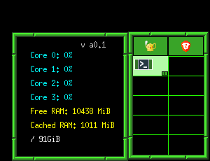

# BeanMon

A simple Linux system monitor that displays CPU usage, memory info, and disk space in a small X11 window.

I recommend using it with fvwm3 and add the following styling in your fvwm3 config file

```
# == Window decors and overrides ==
Style *            Title, Handles, !MWMFunctions, NoDecorHint, StickyIcon
Style *            DepressableBorder 
Style "FvwmPager"  NoTitle, Icon, Sticky, WindowListSkip, Handles, BorderWidth 7
...some more styling here....
Style "BeanMon"     NoTitle, Sticky, WindowListSkip, BorderWidth 7
```



## Build

Make sure you have `gcc` and the X11 development libraries installed (e.g. `libx11-dev` on Debian/Ubuntu).

```bash
make
```

## Run

```bash
./BeanMon
```

## Files

- `main.c` – The source code
- `Makefile` – For building the program
- `LICENSE` – WTFPL (Do What the F*** You Want To Public License)

## License

This project is licensed under the [WTFPL](http://www.wtfpl.net/).  
Do what the f*** you want.

---
BeanGreen247, 2025
